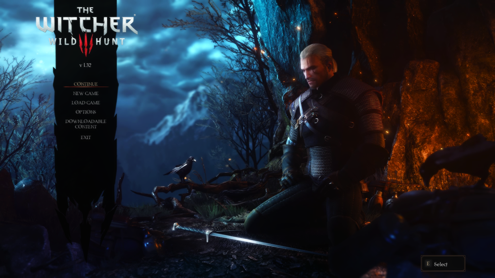

# The Witcher 3 - My Way

- [The Witcher 3 - My Way](#the-witcher-3---my-way)
- [Introduction](#introduction)
- [Installation](#installation)
  - [Installing Microsoft Visual C++ Redistributable Package](#installing-microsoft-visual-c-redistributable-package)
  - [Steam Config](#steam-config)
    - [Disable the Steam Overlay](#disable-the-steam-overlay)
  - [Change Steams Update Behavior](#change-steams-update-behavior)
  - [Using Wabbajack](#using-wabbajack)
    - [Preparations](#preparations)
    - [Downloading and Installing](#downloading-and-installing)
    - [Problems with Wabbajack](#problems-with-wabbajack)
  - [Post-Installation](#post-installation)
    - [Starting the Game](#starting-the-game)
- [Updating](#updating)
- [Gameplay Guide](#gameplay-guide)
- [In-Game Configuration](#in-game-configuration)
- [FAQ](#faq)
- [Performance](#performance)
- [Removing the Modlist](#removing-the-modlist)
- [Credits and Thanks](#credits-and-thanks)
- [Contact](#contact)
- [Contributing](#contributing)
- [Changelog](#changelog)

# Introduction

This is a "Vanilla Plus" style modlist for The Witcher 3 with gameplay enhancements based on FCR3 + nearly everything from Partoutatix.

The game should still feel like TW3 but a much more refined and visually improved experience.

I will not provide support on how to add or change any mods beyond what is
already provided. Do not ask me for help if you changed things. If you do not
have experience modding TW3 and have the ability to read and understand Witcher
Script then I suggest that you do not even think of changing anything.

# Installation

## Installing Microsoft Visual C++ Redistributable Package

I doubt you need to do this since you likely already have this installed. The
package is required for MO2 and you can download it from [Microsoft](https://support.microsoft.com/en-us/help/2977003/the-latest-supported-visual-c-downloads).

Download the x64 version under "Visual Studio 2015, 2017 and 2019". Here is a
[Direct link](https://aka.ms/vs/16/release/vc_redist.x64.exe) if you can't find
it.

## Steam Config

### Disable the Steam Overlay

The Steam Overlay can cause issues with dll mods such as BlitzFX and is
recommended to be turned off.

Open the Properties window (right click the game in your Library->Properties),
navigate to the _General_ tab and un-tick the _Enable the Steam Overlay while in-game_
checkbox.

## Change Steams Update Behavior

TW3 is still being updated by CDPR. Whenever the game updates, it's quite possible
that everything can break due to these changes.

To ensure that Steam does not automatically updates the game for you, head over
to the Properties window, navigate to the _Updates_ tab and change
_Automatic updates_ to _Only update this game when I launch it_.

## Using Wabbajack

### Preparations

Grab the latest release of Wabbajack from [here](https://github.com/wabbajack-tools/wabbajack/releases) and place the `Wabbajack.exe`
file in `X:\Wabbajack`

### Downloading and Installing

The download and installation process can take a very long time depending on
your system specs. Wabbajack will calculate the amount of threads it will use at
the start of the installation.

To have the highest amount of threads and thus the fastest speed, it is advised
to have the working folder on an SSD. You can have the TW3MW and downloads folder
be on separate drives without issue, aside from being limited by the slowest
drive during wabbajack installation.

1. Open Wabbajack
2. Load the Modlist from Disk
3. Set TW3MW to install to `X:\MO2 - TW3MW` and downloads to `X:\MO2 - TW3MW\Downloads`.
   Your downloads folder can be on a separate drive to save space but wabbajack's
   install speed will be limited to your slowest drive.
4. Click the Go/Begin button
5. Wait for Wabbajack to finish

### Problems with Wabbajack

There are a lot of different scenarios where Wabbajack will produce an error.
If you do not see an installation failed warning do not worry about it. If you
feel like wabbajack is stuck or a download is hanging just restart wabbajack,
it will pick up from exactly where you left off.

Please rerun wabbajack at least twice and try to manually download the file
from first before posting about a failed download.

**Could not download x**:

If a mod updated and the old files got deleted, it is impossible to download
them. In this case just wait till I update the Modlist.

**Wabbajack could not find my game folder**:

Wabbajack will not work with a pirated version of the game.

## Post-Installation

### Starting the Game

Head over to the installation folder and locate an executable named
ModOrganizer.exe and launch it. Once its launched there will be a dropdown box
on the top right and a big run button next to it.

Ensure it is set to `The Witcher 3: Wild Hunt` by selecting it in the dropdown
box and then hitting the run button.

# Updating

If this Modlist receives an update please check the Changelog before doing
anything. Always backup your saves or start a new game after updating.

**Wabbajack will delete all files that are not part of the Modlist when updating!**

This means that any additional mods you have installed on top of the Modlist
will be deleted. Your downloads folder will not be touched!

Updating is like installing. You only have to make sure that you select the same
path and tick the _overwrite existing Modlist_ button.

# Gameplay Guide

Eventually, maybe.

# In-Game Configuration

All required configuration has already been done for you.

# FAQ

How do I update to a later version?

- All you have to do is rerun wabbajack with the new version of the installer.
  If you have the downloads wabbajack will hash everything, download any new mods,
  and make the necessary changes in your install folder.

Is [insert mod name here] part of the list?

- Check the modlist manifest. If there is something you want that is not in the
  list, I highly suggest you do not add it unless you know what you’re doing.

Will you add x mod to the list?

- Maybe? [Create a feature request]() so that it can be evaluated.

I think I found a bug! Here are some things that are not bugs:

- Thanks! [Create an issue]() so that it can be tracked.

How do I fiddle with the reshade preset?

- PgUp toggles the reshade settings panel. If you want to mess with the shader settings then make sure to uncheck the checkbox at the bottom right. You'll then see the customization options.

What reshade options ship with the modlist?

- The modlist ships with GrooteS enabled by default but also comes with Ferocious in the 'Benis' folder. You can swap between them in-game in the normal way.

# Performance

My Setup:

- Ryzen 7 3700x
- RTX 3080
- 32GB DDR4
- Game and MO2 running on a m2 drive

I get a consistent 55-60 fps in game. I don't provide support for making your
fps better so please do not ask me.

# Removing the Modlist

You can just remove the MO2 folder and be done with it.

# Credits and Thanks

TW3 - MW made by

- jdsmith2816

Special Thanks

- **_YOU_** for actually reading the readme.
- [Neovalen](https://stepmodifications.org/wiki/User:Neovalen) without whom I would know absolutely nothing about modding TW3
- [BiRaitBec](https://www.nexusmods.com/witcher3/users/43913757), [MegaBound2500](https://www.nexusmods.com/witcher3/users/93890983) and [UndElite88](https://www.nexusmods.com/witcher3/users/75342743) for their amazing TW3 guides on Nexus which are great resources!
- The [GudMod](https://discord.gg/X83vyQEk) and [WolvenWorkshop](https://discord.gg/Hm9yH6b2) modding communities

Mod Authors

- And of course, where would we be without TW3's awesome mod authors? Thank you
  all for releasing the quality content that you guys do.

  **_PLEASE DO NOT FORGET TO ENDORSE THE MOD AUTHORS!_**

# Contact

While I'm always available on the [Wabbajack Discord](https://discord.gg/wabbajack), I would advise checking
the [Issues](https://github.com/jdsmith2816/tw3-mw/issues) (open **and** closed ones) on GitHub first if you have any problems.

**DO NOT DM ME ON DISCORD. I WILL NOT PROVIDE SUPPORT FOR YOU IN DMS**.

# Contributing

See [Contributing](CONTRIBUTING.md).

# Changelog

See [Changelog](CHANGELOG.md).
